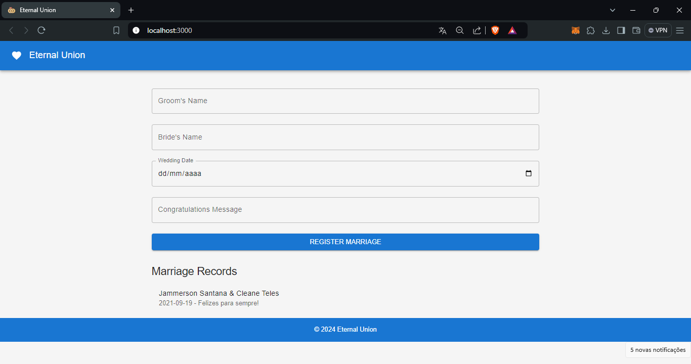

# Eternal Union - Blockchain Marriage Registry

Eternal Union is a decentralized application (dApp) built on the Blockchain that allows the registration of marriages. With this application, couples can record their names, wedding date, and a congratulatory message, creating a permanent and immutable record on the blockchain. The application is built with React on the frontend, Solidity for the smart contract, and uses Material-UI for a modern and responsive interface.

## Table of Contents

- [Description](#description)
- [Technologies Used](#technologies-used)
- [Installation](#installation)
- [Usage](#usage)
- [Contract Deployment](#contract-deployment)
- [Frontend Configuration](#frontend-configuration)
- [Customization](#customization)
- [Contributing](#contributing)
- [License](#license)

## Description

Eternal Union is an application that allows you to register marriages on the blockchain securely and immutably. Each marriage record includes the groom's and bride's names, the wedding date, and a congratulatory message. The application is responsive and intuitive, offering a pleasant and easy-to-navigate user experience.

## Technologies Used

- **Frontend:**
  - React
  - Material-UI
  - Ethers.js

- **Backend:**
  - Solidity
  - Hardhat

- **Blockchain:**
  - Ethereum (Sepolia Testnet)

- **Other:**
  - Infura (for blockchain connection)
  - Metamask (for managing the user's account)
 
 ### Screenshot



### Demo Video

[](./assets/eternalunion.mp4)

*Click the image to watch a short demo video of the Eternal Union application.*

## Installation

Follow the steps below to set up and run the project locally:

### Prerequisites

- Node.js (version 14 or higher)
- NPM (version 6 or higher)
- Metamask (browser extension)

### Clone the Repository

```bash
git clone https://github.com/your-username/eternal-union.git
cd eternal-union
